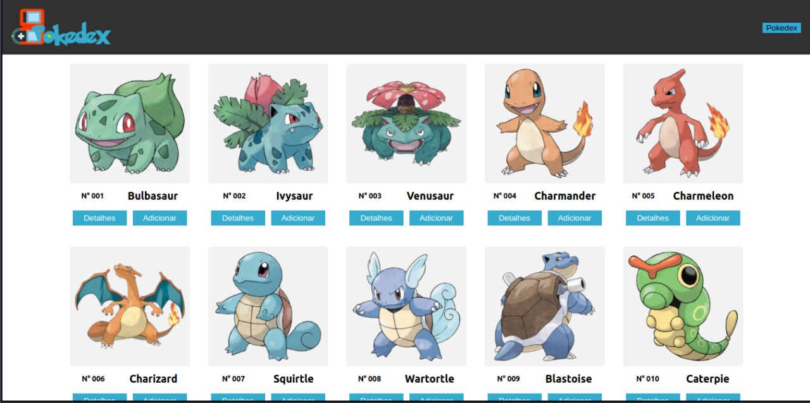

  

  # PokeDex
  
Projeto com proposta fazer uma pokedex utilizando a POKE API
 
  <h3 Align="center">
	<a href="https://numerous-wrist.surge.sh/" cursor='pointer'><button style="cursor: pointer; background-color:#35ACCE; color:white; padding:1rem; border-radius:10px;">PokeDex</button></a>
</h3>

 
 
  

<h3 Align="center"> 
	🚧 🚀 Finalizado <a href="https://numerous-wrist.surge.sh/"><button style="cursor: pointer; background-color:#35ACCE; color:white; padding:1rem; border-radius:10px;">PokeDex</button></a> 🚀 🚧 
</h3>

 
 

### Features

- [x] Lista com pokemons
- [x] Adicionar e excluir pokemons da Pokedex
- [x] Ver detalhes de cada pokemon

 
 

## 🛠 Tecnologias

As seguintes ferramentas foram usadas na construção do projeto:

- [React](https://pt-br.reactjs.org/)
- [Javascript](https://developer.mozilla.org/pt-BR/docs/Web/JavaScript)
- [Styled-Component](https://styled-components.com/)
- [Poke Api](https://pokeapi.co/)

 
 

### Autores
---

<table>
  <tr>
    <td Align="center"><a href="https://www.linkedin.com/in/engmatheusgarrido/"> <b>Matheus Alves</b></a> <a href="https://github.com/alvesgarrido" >👨‍🚀</a>
    </td>
    <td Align="center"><a href="https://github.com/Laeqel"> <b>Túlio Dias</b></a> <a href="https://github.com/Laeqel">👨‍🚀</a>
    </td>
    <td Align="center"><a href="https://www.linkedin.com/in/camily-abade-4a663919a/"> <b>Camily Abade</b></a> <a href="https://github.com/CamilyAbade?tab=repositories">👨‍🚀</a></td>
  </tr>
</table>

 
 
 

Desenvolvedores pós entrega:

